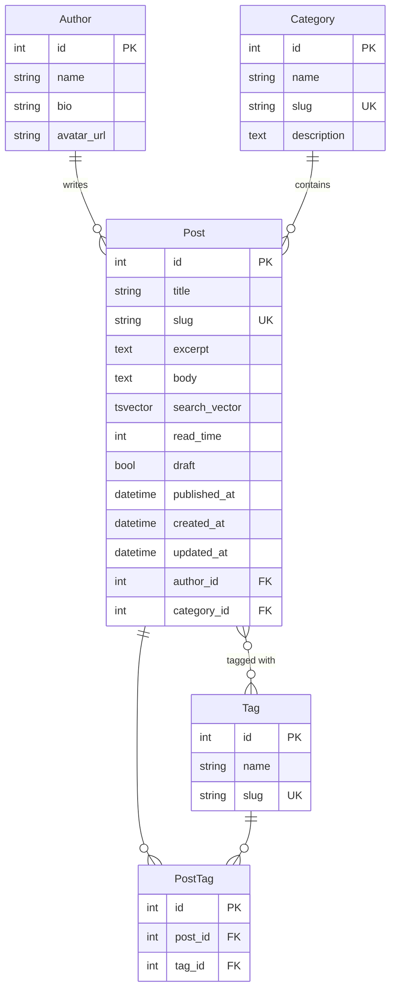
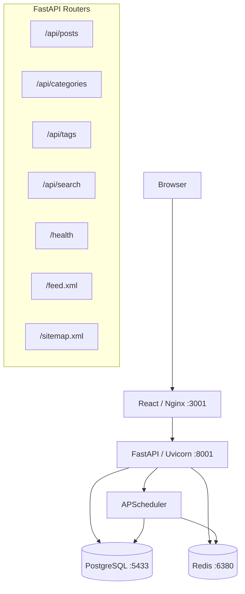

# Personal Blog

<p align="center">
  <em>A personal blog and writing platform — FastAPI backend, React frontend.</em>
</p>

<p align="center">
  
  
  
  
</p>

---

A proof-of-concept personal blog built to explore the FastAPI + React stack. Styled to match a personal portfolio — same dark midnight-blue/violet palette, gold accents, Tomorrow/Anta/Exo 2 fonts, and Tailwind conventions. Posts are written in Markdown, served through a cached REST API, and rendered with full syntax highlighting and GFM support.

### Project Status

| Environment | URL | Notes |
|-------------|-----|-------|
| **Development** | `http://localhost:3001` | Local Docker Compose |
| **Production** | *(not yet deployed)* | Planned |

| Commit | Date | Description |
|--------|------|-------------|
| `db1a61c` | 2026-04-17 | Finished final styling and sample content |
| `f71a91a` | 2026-04-17 | Made a better light mode and fixed some styling |
| `9191ad1` | 2026-04-16 | Improved light mode |

---

## Table of Contents

- [Roadmap](#roadmap)
- [Tech Stack](#tech-stack)
- [Database Schema](#database-schema)
- [Development & Docker](#development--docker)
  - [Quick Start](#quick-start)
  - [.env template](#env-template)
  - [Environment Variables Reference](#environment-variables-reference)
  - [Running locally (without Docker)](#running-locally-without-docker)
- [Project Structure & Architecture](#project-structure--architecture)
  - [Architecture Overview](#architecture-overview)
  - [Data Flow](#data-flow)
  - [Directory Layout](#directory-layout)
  - [Design Decisions](#design-decisions)
- [Features](#features)
  - [Backend](#backend-features)
  - [Frontend](#frontend-features)
  - [Pages](#pages)
- [Post wire format](#post-wire-format)
  - [GET response shape — `Post`](#get-response-shape--post)
  - [Example response payload](#example-response-payload)
  - [POST request shape — `PostCreate`](#post-request-shape--postcreate)
  - [Example create request](#example-create-request)
  - [TypeScript interfaces](#typescript-interfaces)
  - [Pull vs push — two delivery philosophies](#pull-vs-push--two-delivery-philosophies)
  - [Feed endpoints](#feed-endpoints)
- [API Reference](#api-reference)
- [Security](#security)
- [CI/CD](#cicd)
- [Contributing](#contributing)
- [License](#license)

---

## Roadmap

<details id="next" open>
<summary><strong>Near term — content & deployment</strong></summary>

**Content authoring**

- Draft preview — render Markdown in the browser before publishing
- Image upload support — attach images to posts, served from object storage

**Deployment**

- Containerised production deployment (VPS or cloud)
- HTTPS via reverse proxy (Nginx + Let's Encrypt or cloud-managed cert)
- CI pipeline: lint + type check on every push

</details>

<details id="future">
<summary><strong>Future — multi-language backends</strong></summary>

The `backend/` directory is designed to hold multiple implementations of the same API:

```text
backend/
  python/   ← current implementation (FastAPI)
  go/       ← planned
  rust/     ← planned
```

All implementations expose the same REST contract so the React frontend requires no changes. To switch the active backend in Docker Compose, change the build context:

```yaml
backend:
  build:
    context: ./backend/go   # ← swap language here
```

This is the main long-term goal of the project: rebuild the same API in other languages and compare the experience.

</details>

---

## Tech Stack

### Backend

| Technology | Version | Purpose |
|-----------|---------|---------|
| Python | 3.12+ | Runtime |
| FastAPI | 0.115+ | Web framework |
| SQLAlchemy | 2.x (async) | ORM — async engine + session factory |
| Pydantic | v2 | Request/response models (camelCase on wire) |
| PostgreSQL | 16 (Alpine) | Primary database |
| Redis | 7 (Alpine) | Response cache |
| APScheduler | 3.x | Background job scheduler |
| Uvicorn | latest | ASGI server |

### Frontend

| Technology | Purpose |
|-----------|---------|
| React 18 + TypeScript | UI framework |
| Vite | Build tool and dev server |
| Tailwind CSS + `@tailwindcss/typography` | Styling |
| React Markdown + remark-gfm | Markdown rendering with GFM |
| rehype-highlight + highlight.js | Syntax highlighting in code blocks |
| React Router | Client-side routing |

### Infrastructure & Deployment

| Technology | Purpose |
|-----------|---------|
| Docker | Multi-stage builds — Node → Nginx (frontend), Python (backend) |
| Docker Compose | Service orchestration (PostgreSQL + Redis + backend + frontend) |
| Nginx | SPA fallback routing in production frontend container |

### Python Dependencies

| Package | Purpose |
|---------|---------|
| `asyncpg` | Async PostgreSQL driver |
| `aioredis` / `redis[asyncio]` | Async Redis client (singleton) |
| `feedgen` | RSS/Atom feed generation |
| `python-slugify` | Slug generation from post titles |
| `python-dotenv` | Environment variable loading |
| `httpx` | HTTP client for external calls |

---

## Database Schema

### ER Diagram



### Key Constraints

| Constraint | Model | Rule |
|-----------|-------|------|
| Unique | `Post.slug` | Derived from title, collision-handled |
| Unique | `Category.slug`, `Tag.slug` | Auto-generated |
| Unique pair | `PostTag` | `(post_id, tag_id)` |
| Auto-computed | `Post.read_time` | Derived from word count on save |
| Auto-indexed | `Post.search_vector` | GIN index, rebuilt by background job |

---

## Development & Docker

### Quick Start

```bash
# Clone
git clone <repo-url>
cd personal-blog

# Create the root .env file (see the template below) — there is only ONE .env
# at the project root; the backend and frontend both read from it.
```

**Docker (recommended):**

```bash
# Build and start all services (PostgreSQL, Redis, backend, frontend)
docker compose up --build

# Open the blog
open http://localhost:3001

# Open the interactive API docs
open http://localhost:8001/docs
```

### .env (single root file)

There is **one `.env` file at the project root**. It is read by:

- **Docker Compose** (`POSTGRES_*`, `SECRET_KEY`, `ALLOWED_ORIGINS`, `SITE_URL`, `VITE_API_BASE`)
- **The FastAPI backend** — `app/config.py` resolves the project root from its own location and loads the same `.env` whether you run the backend locally or in Docker
- **The Vite frontend** — `vite.config.ts` sets `envDir: '..'` so `npm run dev` and `vite build` both read the root `.env`

`.env` is gitignored and **never committed**. Generate fresh secrets when bootstrapping a new copy:

```bash
# Strong SECRET_KEY (32-byte hex)
python -c "import secrets; print(secrets.token_hex(32))"

# Strong POSTGRES_PASSWORD (URL-safe)
python -c "import secrets; print(secrets.token_urlsafe(24))"
```

The structure of the root `.env`:

```bash
# ── PostgreSQL ──────────────────────────────────────────────────────────────
POSTGRES_DB=blog
POSTGRES_USER=blog_user
POSTGRES_PASSWORD=<generated>

# ── Backend ─────────────────────────────────────────────────────────────────
# Used when running the backend locally without Docker. Inside Docker the
# values from docker-compose (host=db, host=redis) take precedence.
DATABASE_URL=postgresql+asyncpg://blog_user:<password>@localhost:5433/blog
REDIS_URL=redis://localhost:6380/0

SECRET_KEY=<generated>
ALLOWED_ORIGINS=http://localhost:5173,http://localhost:3001
SITE_NAME=Joaquín · Blog
SITE_URL=http://localhost:3001
CACHE_TTL=300
POSTS_PER_PAGE=10

# ── Frontend ────────────────────────────────────────────────────────────────
VITE_API_BASE=http://localhost:8001
```

### Environment Variables Reference

| Variable | Default | Description |
|----------|---------|-------------|
| `POSTGRES_DB` | `blog` | Database name (used by `db` service in Docker Compose) |
| `POSTGRES_USER` | `blog_user` | Database user |
| `POSTGRES_PASSWORD` | — | Database password — must be set, generate a strong value |
| `DATABASE_URL` | `postgresql+asyncpg://...` | Backend connection string (local dev — Docker uses internal hostnames) |
| `REDIS_URL` | `redis://localhost:6380/0` | Redis connection string (local dev) |
| `SECRET_KEY` | — | Reserved for signing/encryption needs — must be a strong random value |
| `ALLOWED_ORIGINS` | `http://localhost:5173,http://localhost:3001` | Comma-separated CORS allowed origins |
| `SITE_NAME` | `Joaquín · Blog` | Site name used in metadata and feeds |
| `SITE_URL` | `http://localhost:3001` | Used in RSS feed and sitemap URLs |
| `CACHE_TTL` | `300` | Redis cache TTL in seconds |
| `POSTS_PER_PAGE` | `10` | Default page size for paginated lists |
| `VITE_API_BASE` | `http://localhost:8001` | Frontend: backend base URL |

### Running locally (without Docker)

**Backend:**

```bash
cd backend/python

python -m venv .venv
source .venv/bin/activate   # Windows: .venv\Scripts\activate

pip install -r requirements.txt

# No per-app .env needed — the backend resolves the root .env from its own path.
# Make sure PostgreSQL and Redis are reachable at the URLs in the root .env
# (defaults assume Docker Compose is running with its published ports).

uvicorn app.main:app --reload   # http://localhost:8001
```

**Frontend:**

```bash
cd frontend

npm install

# Vite reads VITE_API_BASE from the root .env (envDir: '..').
npm run dev   # http://localhost:5173
```

---

## Project Structure & Architecture

### Architecture Overview



### Data Flow

```text
Browser → React fetch → FastAPI router
                              ↓
                        Redis cache hit? → return JSON
                              ↓ miss
                        PostgreSQL query (async SQLAlchemy)
                              ↓
                        Pydantic serialisation (camelCase)
                              ↓
                        Write to Redis cache
                              ↓
                        Return JSON to browser
```

On writes (`POST`, `PUT`, `DELETE`), relevant Redis keys are invalidated immediately so the next read fetches fresh data.

**Background jobs (APScheduler):**

| Schedule | Job |
|----------|-----|
| Every 5 min | Rebuild `search_vector` (tsvector) for new/modified posts |
| Every hour | Regenerate `/feed.xml` (Atom/RSS via feedgen) |
| Every hour | Warm Redis cache (re-fetch top posts) |

### Directory Layout

```text
personal-blog/
├── docker-compose.yml          # Orchestrates all services
├── .env                        # Single root env file (gitignored) — read by Docker, backend, and frontend
│
├── backend/
│   └── python/                 # FastAPI implementation
│       │                       # (add go/, rust/, etc. alongside for other languages)
│       ├── app/
│       │   ├── main.py         # App factory, CORS, startup/shutdown lifecycle
│       │   ├── config.py       # Settings loaded from environment variables
│       │   ├── database.py     # Async SQLAlchemy engine and session factory
│       │   ├── redis_client.py # Async Redis client (singleton)
│       │   │
│       │   ├── models/
│       │   │   └── post.py     # SQLAlchemy ORM: Author, Category, Tag, Post
│       │   │
│       │   ├── schemas/
│       │   │   └── post.py     # Pydantic v2 request/response models (camelCase on wire)
│       │   │
│       │   ├── routers/
│       │   │   ├── posts.py    # CRUD endpoints for posts
│       │   │   ├── categories.py
│       │   │   ├── tags.py
│       │   │   ├── search.py   # Full-text search
│       │   │   └── health.py   # DB + Redis health check
│       │   │
│       │   └── services/
│       │       ├── cache.py    # Redis get/set/delete helpers
│       │       └── scheduler.py # APScheduler background jobs
│       │
│       ├── requirements.txt
│       └── Dockerfile
│
└── frontend/
    ├── src/
    │   ├── types/index.ts      # TypeScript interfaces (Post, Category, Tag, ...)
    │   ├── data/index.ts       # API client + SITE constants
    │   ├── utils/slugify.ts
    │   │
    │   ├── components/
    │   │   ├── icons/          # SVG icons as React components (no icon library)
    │   │   ├── layout/         # Navbar (with search), Footer
    │   │   └── ui/             # Section, PostCard, Prose, Pagination, Tag, Stars, ...
    │   │
    │   ├── sections/           # Page-level composition blocks
    │   │   ├── Hero.tsx        # Landing hero with Typewriter + RoleRotator
    │   │   ├── FeaturedPosts.tsx
    │   │   ├── RecentPosts.tsx
    │   │   └── CategoryList.tsx
    │   │
    │   └── pages/              # One file per route
    │       ├── Home.tsx
    │       ├── Post.tsx        # Single post with reading progress bar
    │       ├── Category.tsx
    │       ├── About.tsx
    │       ├── Search.tsx
    │       └── NotFound.tsx
    │
    ├── tailwind.config.js      # Includes @tailwindcss/typography
    ├── nginx.conf              # SPA fallback for production
    └── Dockerfile              # Multi-stage: Node build → Nginx serve
```

### Design Decisions

| Decision | Rationale |
|----------|-----------|
| Async FastAPI | All I/O is async — DB queries (asyncpg), Redis reads, feed generation. No blocking the event loop. |
| Redis caching | List and detail endpoints are read-heavy. Caching with pattern-based invalidation on writes avoids repeated DB hits. |
| PostgreSQL full-text search | `tsvector` + GIN index gives relevance-ranked search without adding Elasticsearch to the stack. |
| Pydantic v2 + camelCase | camelCase aliases on all response models so React can consume them directly without name-mangling. |
| APScheduler inside the app | Simpler than adding Celery + broker for a personal project. Rebuilds search vectors and warms cache on a schedule. |
| No icon library | SVG icons are inlined as React components — zero runtime dependency and full control over stroke widths and sizing. |
| Tailwind typography plugin | `@tailwindcss/typography` handles Markdown-rendered prose styling (headings, code, blockquotes) without custom CSS. |
| Multi-language backend dir | `backend/python/` is the first implementation. `backend/go/` and `backend/rust/` can sit alongside it; switching requires only one line in `docker-compose.yml`. |

---

## Features

### Backend Features

- **Full CRUD API** — create, read, update, and delete blog posts via REST
- **PostgreSQL full-text search** — `tsvector` + GIN index for fast relevance-ranked search; no Elasticsearch needed
- **Redis caching** — `GET /api/posts` and `GET /api/posts/{slug}` cached with automatic pattern-based invalidation on writes
- **APScheduler background jobs**:
  - Every 5 minutes: rebuilds `search_vector` for new/modified posts
  - Every hour: generates `/feed.xml` (Atom/RSS feed via feedgen)
  - Every hour: warms the Redis cache
- **RSS feed** — served at `/feed.xml`, regenerated hourly
- **Sitemap** — served at `/sitemap.xml`, generated on request
- **Tag and category filtering** — `GET /api/posts?tag=redis&category=backend`
- **Pagination** — `GET /api/posts?page=2&pageSize=10`
- **Auto slug generation** — derived from the post title with collision handling
- **Auto read-time calculation** — computed from word count on save
- **Health endpoint** — `GET /health` reports DB and Redis status
- **CORS** — configured for the frontend origin via environment variable
- **Interactive API docs** — Swagger UI at `/docs`, ReDoc at `/redoc`

### Frontend Features

- **Matching portfolio palette** — midnight blue/violet surfaces (`slate-950`), gold + violet accents, Tomorrow/Anta/Exo 2 fonts, CSS keyframe animations
- **Dark and light mode** — full theme toggle persisted across sessions; both modes polished
- **Reading progress bar** — thin gradient bar at the top of each post page
- **Markdown rendering** — posts stored and rendered as Markdown with GitHub Flavored Markdown support (`remark-gfm`)
- **Syntax highlighting** — code blocks rendered with `rehype-highlight` + `highlight.js` using a dark theme
- **Inline search** — search input in the Navbar, navigates to `/search?q=...`
- **Category pages** — `/categories/:slug` lists all posts in a category
- **Pagination** — client-driven, calls the paginated API
- **Skeleton loading states** — animated placeholders while fetching
- **Author card** — shown at the bottom of each post when author data is present
- **RSS link** — in the footer, pointing to `/feed.xml` on the backend
- **Star rating display** — decorative star component used across post cards

### Pages

#### Home

The landing page. Shows the blog's hero section and a snapshot of content:

- **Hero** — animated typewriter effect with rotating role/title text
- **Featured posts** — editorially selected posts shown with large cards
- **Recent posts** — latest published posts in chronological order
- **Category list** — all categories with post counts, linking to their pages

#### Post (`/posts/:slug`)

The single-post reading experience:

- **Reading progress bar** — thin gradient bar at the top of the viewport, fills as you scroll
- **Rendered Markdown** — full GFM: tables, task lists, footnotes, strikethrough
- **Syntax highlighting** — fenced code blocks highlighted by language
- **Author card** — avatar, name, and bio rendered below the post body
- **Tags** — tag pills linking to their respective tag pages

#### Category (`/categories/:slug`)

Lists all posts belonging to a category, paginated. Same PostCard layout as the home page.

#### About

A personal "about me" page. Static content describing the author, background, and what the blog covers. Styled as a Markdown prose section.

#### Search (`/search?q=...`)

Full-text search page. Query is passed to `GET /api/search?q=...` which runs the PostgreSQL `tsvector` search and returns relevance-ranked results. Skeleton states shown while loading.

#### Not Found

Custom 404 page with navigation back to home.

---

## Post wire format

This is the canonical JSON shape of a blog post as exposed over the REST API. It is **the same shape across every endpoint that returns a post** — single post, list items, feed items, and the publish webhook payload. Any frontend (this project's React app or any third-party consumer) should align against this contract.

All fields are serialised in **camelCase** on the wire (Pydantic v2 `alias_generator=to_camel`). Dates are ISO 8601 with timezone (UTC).

### GET response shape — `Post`

Every endpoint that returns a post — `GET /api/posts`, `GET /api/posts/{slug}`, `GET /api/feed`, `POST /api/feed/webhook` — serialises the **same** `Post` object. Align against this shape and your consumer works against all four.

| Field | Type | Nullable | Description |
|-------|------|----------|-------------|
| `slug` | `string` | no | URL-safe unique identifier. Derived from the title, collision-handled by suffix. |
| `title` | `string` | no | Post title as written by the author. |
| `excerpt` | `string` | no | Short summary (plain text, typically 1-3 sentences). May be empty. |
| `body` | `string` | no | Full post body in Markdown with GFM (tables, task lists, footnotes, strikethrough, fenced code blocks). Bare URLs (`https://…`, `www.…`) are auto-linked by the renderer. Inline image syntax `` is intentionally **not** rendered — it would fight the floated cover image in the post layout. |
| `publishedAt` | `string` (ISO 8601) | no | Publication timestamp in UTC. Used for ordering in the feed. |
| `updatedAt` | `string` (ISO 8601) | yes | Last edit timestamp in UTC. `null` if the post has never been edited since publication. |
| `readTimeMinutes` | `integer` | no | Estimated read time in whole minutes. Computed from word count on save (≈200 wpm, floor of 1). |
| `coverImage` | `string` | yes | Either an absolute URL (`https://…`) or a relative path (`/uploads/<filename>`) served by this backend. Clients should resolve relative paths against the API base. Every post on this blog has a cover image; `null` is only possible for legacy rows. |
| `draft` | `boolean` | no | `true` for drafts (excluded from all public endpoints), `false` for published posts. |
| `tags` | `string[]` | no | Array of tag names drawn from a fixed, category-scoped catalogue. Empty array if untagged. Order is insertion-stable but not semantically meaningful. The blog collapses anything past the first 5 behind a "…" chip. |
| `category` | `string` | no | One of `"Engineering"`, `"Hobbies"`, `"Personal Life"`, or `""` when uncategorised. A post belongs to at most one category and the enum is enforced by the backend. |
| `author` | `object \| null` | yes | Author object (see below). `null` when no author is attached; consumers should fall back to a site-level default. |
| `author.name` | `string` | no | Author's display name. |
| `author.avatar` | `string` (URL) | yes | Absolute URL to the author's avatar image. |
| `author.bio` | `string` | yes | Short author bio (plain text). |
| `author.socials` | `object \| null` | yes | Map of social-platform → handle/URL. Known keys: `github`, `linkedin`, `twitter`, `email`. Absent keys mean "no link". `null` when the author has no socials. |

### Example response payload

```json
{
  "slug": "async-fastapi-with-sqlalchemy-2-0",
  "title": "Async FastAPI with SQLAlchemy 2.0",
  "excerpt": "FastAPI is async top to bottom. Your database layer had better be too — SQLAlchemy 2.0 makes that painless.",
  "body": "# Async FastAPI with SQLAlchemy 2.0\n\nFastAPI is async top to bottom...\n\n## Engine and session\n\n```python\nfrom sqlalchemy.ext.asyncio import create_async_engine\n```\n\nRead more at https://docs.sqlalchemy.org/en/20/ or www.pydantic.dev.",
  "publishedAt": "2026-04-17T12:00:00+00:00",
  "updatedAt": null,
  "readTimeMinutes": 4,
  "coverImage": "/uploads/14c0f04d38c6c9ce7e3b6924.jpg",
  "draft": false,
  "tags": ["python", "backend", "api-design", "performance"],
  "category": "Engineering",
  "author": null
}
```

### POST request shape — `PostCreate`

`POST /api/posts` accepts a `PostCreate` body. Field names are camelCase on the wire; the backend also accepts the underlying snake_case names for interoperability.

| Field | Type | Required | Default | Description |
|-------|------|----------|---------|-------------|
| `title` | `string` | **yes** | — | Post title. Also the basis for the auto-generated slug. |
| `body` | `string` | yes (in practice) | `""` | Post body in Markdown (GFM). Stored as-is; rendered by the frontend. |
| `excerpt` | `string` | no | `""` | Short summary. Used in list cards and meta tags. |
| `coverImage` | `string` | no | `null` | Absolute URL or a backend-relative `/uploads/<filename>` path. The blog UI requires one before publish. |
| `draft` | `boolean` | no | `false` | `true` hides the post from every public endpoint. |
| `tags` | `string[]` | no | `[]` | Tag names. Drawn from the category's catalogue on the blog UI; the API itself does not enforce membership. |
| `category` | `"Engineering" \| "Hobbies" \| "Personal Life" \| null` | no | `null` | Enum-validated by the backend — any other value returns `422`. |
| `publishedAt` | `string` (ISO 8601) | no | server time | Override the publish timestamp. |

**Responses:**

| Status | When |
|--------|------|
| `201` | Created. Body is the full `Post` (same shape as GET). |
| `422` | Validation error — typically `category` outside the enum, or a missing required field. |

### Example create request

```bash
curl -X POST http://localhost:8001/api/posts \
  -H "Content-Type: application/json" \
  -d '{
    "title": "Async FastAPI with SQLAlchemy 2.0",
    "excerpt": "A practical walkthrough of wiring async sessions into a FastAPI app.",
    "body": "# Hello\n\nPost body in **Markdown**.",
    "category": "Engineering",
    "tags": ["python", "backend", "api-design"],
    "coverImage": "/uploads/14c0f04d38c6c9ce7e3b6924.jpg",
    "draft": false
  }'
```

The response is the full `Post` object, and the post is immediately reachable at `/posts/<generated-slug>` on the frontend.

### TypeScript interfaces

Drop these straight into any TypeScript consumer to stay aligned with the contract:

```ts
export type PostCategory = 'Engineering' | 'Hobbies' | 'Personal Life'

export interface Author {
  name: string
  avatar: string | null
  bio: string | null
  socials: {
    github?: string
    linkedin?: string
    twitter?: string
    email?: string
  } | null
}

// GET response shape — returned by every post-serving endpoint.
export interface Post {
  slug: string
  title: string
  excerpt: string
  body: string                      // Markdown (GFM); inline  is dropped
  publishedAt: string               // ISO 8601 UTC
  updatedAt: string | null          // ISO 8601 UTC
  readTimeMinutes: number
  coverImage: string | null         // absolute URL or "/uploads/<filename>"
  draft: boolean
  tags: string[]
  category: PostCategory | ''
  author: Author | null
}

// POST request body — omitted fields fall back to their defaults.
export interface PostCreate {
  title: string
  body: string
  excerpt?: string
  coverImage?: string
  draft?: boolean
  tags?: string[]
  category?: PostCategory
  publishedAt?: string
}

// Feed pagination envelope (returned by GET /api/feed).
export interface FeedPage {
  items: Post[]
  page: number                      // 1-indexed
  pageSize: number                  // always 3
  totalPages: number                // 1–3
  totalPosts: number                // 0–9
  hasNext: boolean
  hasPrev: boolean
}
```

### Pull vs push — two delivery philosophies

The blog exposes two shapes of delivery for the same canonical `Post` payload. They are deliberately complementary — each covers a weakness of the other.

```text
                     ┌───────────────────────────────────────────┐
                     │           Blog backend (origin)           │
                     └───────────────────────────────────────────┘
                          ▲                            │
                          │  GET /api/feed             │  POST /api/feed/webhook
                          │  (consumer asks)           │  (origin notifies)
                          │                            ▼
                     ┌──────────┐                 ┌──────────┐
                     │ Consumer │                 │ Consumer │
                     │   PULL   │                 │   PUSH   │
                     └──────────┘                 └──────────┘
```

**`GET /api/feed` — pull model.** The consumer decides when to fetch. The server is passive and simply answers whoever asks. This is the web's default shape: cacheable, idempotent, safe to retry, trivial to debug with `curl`. The cost is latency and freshness — the consumer only sees a new post when it next polls, so there's always a lag (up to the polling interval) and a lot of wasted requests when nothing has changed. Pull is the right default when:

- The consumer renders on demand (a frontend page load, an SSG build step, a reader RSS client)
- Stale-by-a-few-minutes is fine
- You don't want to maintain a list of subscribers on the server
- You want HTTP caching (CDN, browser, Redis) to do most of the work

**`POST /api/feed/webhook` — push model.** The origin decides when to deliver. Publishing a post triggers an immediate outbound call carrying the payload, so subscribers learn about the new post the moment it exists. The cost is operational complexity — you now own a delivery pipeline with retries, failure handling, signature verification, and a list of subscribers to maintain. Push is the right shape when:

- Freshness matters more than simplicity (mirrors, social auto-post, search indexers, Slack/Discord bots)
- Polling would be wasteful (thousands of consumers checking every minute for a change that happens once a day)
- The consumer is a server rather than a browser (browsers can't host an inbound HTTP endpoint)

**How they compose.** The two models are not mutually exclusive — they cover different consumer profiles of the same post. A React frontend pulls `GET /api/feed` on page load (simple, cacheable). A Slack bot or mirror site subscribes to the webhook and reacts only when something actually changes (efficient, real-time). Both receive the **same canonical `Post` shape**, which is the whole point of aligning the wire format: one contract, two delivery strategies, zero duplication.

**Important asymmetry.** `GET /api/feed` gives you a window of the 9 most recent posts so a fresh consumer can backfill its view with one call. `POST /api/feed/webhook` delivers exactly **one** post — the one that just got published. Consumers that miss webhook deliveries (network errors, downtime) should fall back to `GET /api/feed` to reconcile, which is why both endpoints return the same shape and expose published posts in the same order.

### Feed endpoints

Two dedicated endpoints expose this canonical shape to external frontends:

| Method | Path | Model | Purpose |
|--------|------|-------|---------|
| `GET` | `/api/feed?page=N` | Pull | Consumer-initiated. Paginated read of the last 9 published posts, 3 per page (`page` is 1, 2, or 3). Safe, cacheable, idempotent. |
| `POST` | `/api/feed/webhook` | Push | Origin-initiated. Fired immediately on publish; carries the just-published post in the canonical shape as its payload. Body is optional — see below. |

#### `GET /api/feed`

Returns the `FeedPage` shape above. Intended to be polled or hydrated on page load by subscriber frontends that don't want to consume the full `/api/posts` listing.

```bash
curl -s http://localhost:8001/api/feed?page=1 | jq
```

```json
{
  "items": [ /* 3 Post objects */ ],
  "page": 1,
  "pageSize": 3,
  "totalPages": 3,
  "totalPosts": 9,
  "hasNext": true,
  "hasPrev": false
}
```

Constraints:

- `page` is clamped to `1 ≤ page ≤ 3` (422 if out of range).
- Always serves up to the 9 most recent **published** posts (drafts are never exposed here).
- Response is cached in Redis; cache is invalidated automatically on publish via the webhook below.

#### `POST /api/feed/webhook`

The publish webhook. This is the push-shaped endpoint — fire it as part of the publish flow and the response body **is the payload** subscribers receive.

**Request body** (optional):

```json
{ "slug": "async-fastapi-with-sqlalchemy-2" }
```

- If `slug` is provided, returns that specific post (regardless of `draft` status, since this endpoint represents "the post was just published").
- If the body is omitted or empty, returns the most recently published post.

**Response**: 200 with a single `Post` object (the canonical shape above).

```bash
# Fire on publish, targeting a specific slug
curl -s -X POST http://localhost:8001/api/feed/webhook \
  -H "Content-Type: application/json" \
  -d '{"slug": "async-fastapi-with-sqlalchemy-2"}' | jq

# Or with no body — returns the latest published post
curl -s -X POST http://localhost:8001/api/feed/webhook | jq
```

**Errors**:

| Status | When |
|--------|------|
| `404` | `slug` given but no such post exists, or no body and no published posts exist at all |

The webhook invalidates the feed cache (`feed:*`) and the post-list cache (`posts:list:*`) so the next `GET /api/feed` call reflects the new post.

---

## API Reference

| Method | Path | Description |
|--------|------|-------------|
| `GET` | `/api/posts` | List posts. Params: `page`, `pageSize`, `tag`, `category`, `includeDrafts` |
| `POST` | `/api/posts` | Create a post |
| `GET` | `/api/posts/{slug}` | Get a single post |
| `PUT` | `/api/posts/{slug}` | Update a post |
| `DELETE` | `/api/posts/{slug}` | Delete a post |
| `GET` | `/api/feed` | Paginated canonical feed — last 9 posts, 3 per page (see [Post wire format](#post-wire-format)) |
| `POST` | `/api/feed/webhook` | Publish webhook — returns the just-published post in canonical format |
| `GET` | `/api/categories` | List all categories with post counts |
| `GET` | `/api/categories/{slug}` | Get a single category |
| `GET` | `/api/tags` | List tags sorted by usage |
| `GET` | `/api/search?q=...` | Full-text search (PostgreSQL tsvector) |
| `GET` | `/health` | DB + Redis health check |
| `GET` | `/feed.xml` | Atom/RSS feed |
| `GET` | `/sitemap.xml` | XML sitemap |
| `GET` | `/docs` | Interactive API docs (Swagger UI) |
| `GET` | `/redoc` | ReDoc API docs |

Interactive docs are available at `http://localhost:8001/docs` when the backend is running.

---

## Security

| Area | Implementation |
|------|---------------|
| **CORS** | Configured via `ALLOWED_ORIGINS` env var. Only listed origins may call the API. |
| **Secret key** | `SECRET_KEY` env var. Must be a strong random value in production. |
| **Docker** | Backend runs as a non-root user inside the container. `.dockerignore` excludes `.env*` files. |
| **DB port** | PostgreSQL bound to `localhost` only — not exposed to the Docker host network. |
| **No secrets in image** | `.env*` excluded from all Docker images via `.dockerignore`. |
| **Input validation** | Pydantic v2 validates all request bodies at the framework boundary. |
| **SQL injection** | All queries use SQLAlchemy ORM or parameterised statements — no raw string interpolation. |

### Future Security Improvements

| Priority | Improvement | Why |
|----------|------------|-----|
| **High** | Rate limiting on search + list endpoints | Prevents abuse of the full-text search |
| **Medium** | HTTPS in production | TLS termination at reverse proxy or cloud provider |
| **Medium** | Content-Security-Policy header | Supplementary XSS protection |
| **Low** | Referrer-Policy header | Prevents referrer leakage to external links |
| **Low** | Request ID tracking | Log correlation across frontend and backend |

---

## CI/CD

No CI/CD pipeline exists yet. Planned:

| Workflow | Trigger | Jobs |
|----------|---------|------|
| **CI** | Push to `main`, PRs | Ruff lint, mypy type check, pytest (if tests are added) |
| **Dependabot** | Weekly | Grouped Python + Node dependency updates |
| **Deploy** | Push to `main` | Build Docker images, push to registry, deploy to server |

The project currently follows a simple single-branch workflow on `main`. When CI is set up:

- `main` will be protected — no direct pushes
- A `development` branch will be used for day-to-day work
- A PR to `main` will be required to merge, with CI passing

---

## Contributing

This is a personal project and not open to outside contributions, but the development workflow is documented here for reference.

### Development Workflow

```bash
# Install backend dependencies
cd backend/python
python -m venv .venv && source .venv/bin/activate
pip install -r requirements.txt

# Install frontend dependencies
cd frontend
npm install
```

1. Make changes in `backend/python/` or `frontend/src/`
2. Run Docker Compose to verify the full stack works end-to-end
3. Commit with a short message describing what changed
4. `git push origin main`

### Code Conventions

| Area | Convention |
|------|-----------|
| **API responses** | camelCase field names (Pydantic aliases) — consumed directly by React |
| **Models** | SQLAlchemy ORM, explicit `__tablename__`, async session everywhere |
| **Routers** | One file per resource (`posts.py`, `categories.py`, etc.) |
| **Schemas** | Separate `Create`, `Update`, and `Response` Pydantic models per resource |
| **Services** | Business logic (caching, scheduling) extracted out of routers |
| **React components** | One component per file; UI primitives in `components/ui/`, page sections in `sections/`, routes in `pages/` |
| **TypeScript** | All API responses typed — interfaces in `types/index.ts` |
| **Styling** | Tailwind utility classes only; no custom CSS except the Tailwind config |

### Adding a New Backend Language

1. Create `backend/<language>/` alongside `backend/python/`
2. Implement the same REST API contract (same paths, same response shapes)
3. Add a Dockerfile inside the new directory
4. Update `docker-compose.yml` to point `backend.build.context` at the new directory
5. The frontend requires no changes

---

## License

Personal project — all rights reserved.
